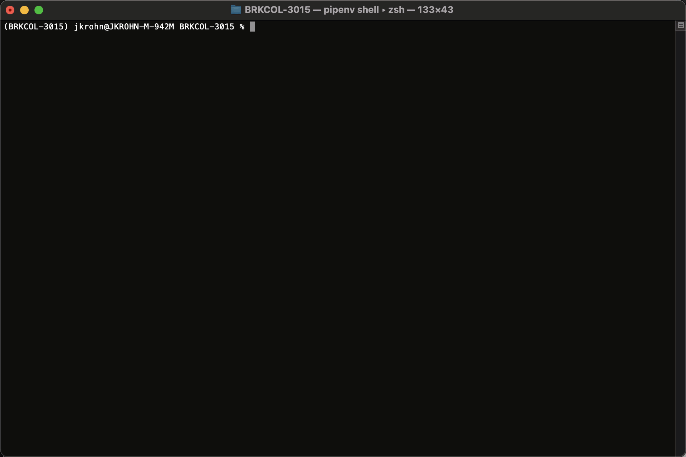
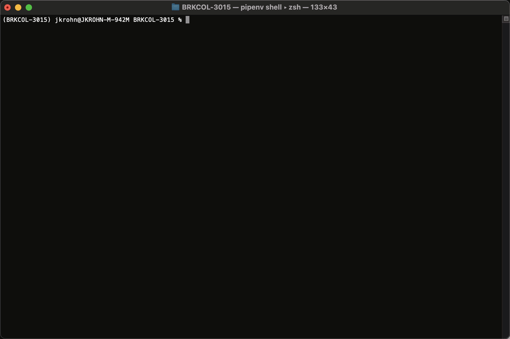

# Examples for BRKCOL-3015 at Cisco Live US '23

# Preparing the environment

To prepare a Python environment it's
highly recommended to use [pipenv](https://docs.pipenv.org/en/latest/index.html) to manage Python virtual environments.
Pls. follow the instructions at https://docs.pipenv.org/en/latest/basics.html.

With `pipenv` installed in the main directory of the project you can simply install the project requirements with

    pipenv install

# Running the examples

## `list_locations_direct.py`

This example shows how to access a Webex API REST endpoint directly without using the SDK. The script relies on the
environment variable `WEBEX_TOKEN` to contain a valid access token that will be used to authorize access to the API
endpoint. The script loads a `.env` file from the current directory. An example `.env` is provided as `.env (sample)`
you can rename this file to `.env` and then add the value of an access token to the file.

The easiest way to obtain a valid access token to run this script is to grab an access token
from https://developer.webex.com/docs/getting-started.

This animation shows the process to get a developer access token:

With the environment variable set the script can be executed directly from the command line as shown in the following
animation:

## `list_locations_sdk.py`

This example does exactly the same thing as the previous example, but uses the wxc_sdk SDK. This script relies on
the `WEBEX_TOKEN` environment variable as well. The purpose of this example is to show how a simple application of the
SDK.

The script can be executed directly from the command line as shown in the following
animation:

## `list_locations_sdk_int_tokens.py`

This is a demo of how to call a Webex API endpoint using the SDK with cached integration tokens. For this script to
operate you need to create an integration on developer.webex.com in the "My Webex Apps" section of your profile in the
upper right corner of the developer portal.

A possible set of scopes to request is:

* Identity:one_time_password
* spark-admin:devices_read
* identity:placeonetimepassword_create
* spark:people_read
* spark:devices_write
* spark-admin:telephony_config_read
* spark-admin:telephony_config_write
* spark:devices_read
* spark-admin:devices_write
* spark-admin:people_read

When creating the integration make sure to add `http://localhost:6001/redirect` as a redirect URI. The script will start
a temporary webserver listening on this port to finish the OAuth flow.

Then you need set these environment variables in your `.env` file:

* `INTEGRATION_CLIENT_ID`: client id
* `INTEGRATION_CLIENT_SECRET`: client secret, make sure to copy the secret immediately when creating the integration.
  The
  secret is only displayed once and later can only be re-created, which changes the secret.
* `INTEGRATION_SCOPES`: scopes defined for your integration. You can also simply copy/paste the "OAuth Authorization
  URL" from the integration details page. The scopes will be parsed from that URL

The script when started for the first time will initiate an OAuth flow by redirecting the system browser to the required
URL. A minimal web server is started waiting for the final redirect. With the authorization code obtained as the result
of that flow access tokens are obtained and written to a local file (`int_tokens.yml`).

When run again the cached tokens are read from that file. If the access token is close to the end of the lifetime a new
access token is obtained using the refresh token.

This animation shows the execution of this script:

# The web application

The folder `web_app` contains an example of a simple user portal for Webex Calling users. The web app requires these
environment variables to be set in the `.env` file in the `web_app` directory. You can use the `.env (sample)` file as a
template.

* CLIENT_ID: client id of an integration to be used for "Login with Webex". The integration does not have to have any
  meaningful scopes. Can be the same integration that has been created for the `list_locations_sdk_int_tokens.py`
  example.
* CLIENT_SECRET: client secret of the same integration
* SERVICE_APP_CLIENT_ID: client id of service app the web app will use to drive the Webex APIs. This and the following
  two parameters are obtained as part of the service app authorization as described
  here: https://developer.webex.com/docs/service-app#service-app-creation-admin-flow
* SERVICE_APP_CLIENT_SECRET: client secret
* SERVICE_APP_REFRESH_TOKEN: refresh token.

The service app requires these scopes for the demo app to work properly. Make sure to select these scopes when creating
the service app on developer.webex.com.

* `Identity:one_time_password`
* `spark-admin:devices_read`
* `identity:placeonetimepassword_create`
* `spark:people_read`
* `spark:devices_write`
* `spark-admin:telephony_config_read`
* `spark-admin:telephony_config_write`
* `spark:devices_read`
* `spark-admin:devices_write`
* `spark-admin:people_read`

With the parameters in the `.env` file set there are two options to start the local web server:

1) execute the `app.py` script in the `web_app` folder
2) start the web server in a Docker container. This requires that Docker is installed on the host machine. With Docker
   installed the server can be started by `docker-compose up -d` followed by `docker-compose logs -f` to see the logs.
   The animation below shows how the output of this should look like.

With the local web server started, either by executing `app.py` or by running the server in a Docker container, you can
point your web browser to http://localhost:5010. This should redirect you to a page from where you can initiate the
login via Webex. After successfully authenticating as a Webex Calling user within the organization you created the
service app tokens for you should get to the Dashboard that shows the phones of the users and the call queues the user
is an agent in. In the last column of the call queue table the user can then join and unjoin each queue (if that is
allowed). If you enable the developer console of the browser you can monitor the network activity which also shows the
Ajax requests from the client side Javascript logic.

This is the overall project structure of the web app:

    ├── app.py - stub to start local dev server
    └── flaskr
        ├── __init__.py
        ├── app_with_tokens.py
        ├── routes.py
        ├── static
        │   ├── css
        │   │   ├── datatables.css
        │   │   ├── login.css
        │   │   ├── nunito.css
        │   │   └── sb-admin-2.css
        │   ├── font-awesome-free
        │   │   ├── css
        │   │   │   └── all.min.css
        │   │   └── webfonts
        │   │       ├── fa-brands-400.eot
        │   │       ├── fa-brands-400.svg
        │   │       ├── fa-brands-400.ttf
        │   │       ├── fa-brands-400.woff
        │   │       ...
        │   ├── fonts
        │   │   ├── nunito-v25-latin-200.woff2
        │   │   ...
        │   ├── img
        │   │   ├── undraw_profile.svg
        │   │   ├── undraw_profile_1.svg
        │   │   ├── undraw_profile_2.svg
        │   │   ├── undraw_profile_3.svg
        │   │   ├── undraw_rocket.svg
        │   │   ├── webex-3d-symbol-color_192x192.png
        │   │   └── webex-3d-symbol-color_24x24.png
        │   └── js
        │       ├── bootstrap.bundle.js
        │       ├── bootstrap.bundle.js.map
        │       ├── datatables.js
        │       ├── jquery.easing.min.js
        │       ├── jquery.min.js
        │       ├── portal
        │       │   ├── user_info.js
        │       │   ├── user_phones.js
        │       │   └── user_queues.js
        │       └── sb-admin-2.js
        └── templates
            ├── base.html
            ├── base_no_body.html
            ├── body_js.html
            ├── footer.html
            ├── index.html
            ├── login.html
            ├── sidebar.html
            └── topbar.html
